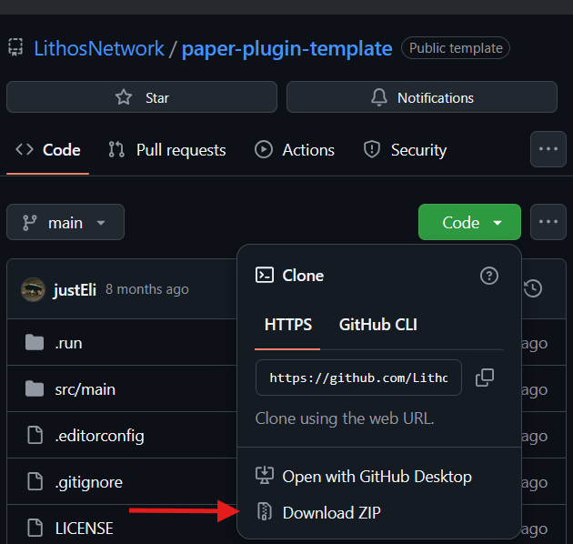
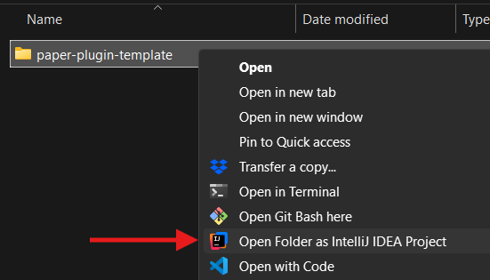
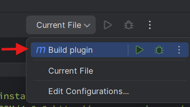
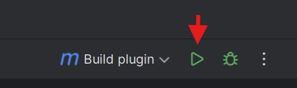

# paper-plugin-template

> [!NOTE]  
> No experience needed in programming or server management.

## Introduction

This *repository* is a template with example code, to make a very basic Minecraft plugin for [Paper Minecraft server software](https://papermc.io/downloads/paper). This guide is for beginners who want to learn how to make their first plugin. You don't really need programming experience, in my opinion. This is actually a good way to start learning how to program.

## Project setup

### Code editor

We need to download and install IntelliJ IDEA Community Edition, if you haven't already. This is a free code editor (IDE) for Java, which all Paper plugins are made in. Scroll down to IntelliJ IDEA Community Edition [on this page to download the IDE](https://www.jetbrains.com/idea/download/). Ultimate is the paid version, which is not needed.

After installation, we need to set up the Software Development Kit (SDK). It will either ask you about setting this up when running IntelliJ for the first time, or you can set it up by going to File > Project Structure... > SDK, and click 'Download JDK'. You can select any JDK from the list.

### Download example code

If you already know how to *clone* a *repository* to your machine, you can do that. If you don't, you can download the example code as a ZIP file. To download the ZIP file, do the following:

- Click on 'Code' on the GitHub page.
- At the bottom, click 'Download ZIP'.
- Extract the ZIP to an appropriate location.

### Open example code with code editor

Open the folder 'paper-plugin-template' as IntelliJ project by right-clicking the folder. You may need to click 'Show more options'. If it asks you to load a Maven project after opening, load it.

## Start writing code

TODO

## Build the plugin

To build the 'jar' of the plugin, click 'Current File' on the top right, then select 'Build plugin', and click the green arrow. This should generate a JAR file into the root directory of the project, with the name 'paper-plugin-template-0.1.jar'. This is now a Paper plugin.

### Change name and Minecraft version

You can find more build-settings for the plugin in the file 'pom.xml'. This is a Maven project file. You can change things like name, version, and Minecraft Paper version.

## Install it on a Minecraft server

The JAR file can be dropped into the 'plugins' folder of your Paper Minecraft server. There are a lot of tutorials on how to set up a Minecraft server. Running one locally is really easy and only requires Java to be installed on your system. If you have one running locally, you can access it by connecting to 'localhost'.

If you didn't change the example code, with this plugin installed on your server, it will send you a message to your action bar every time you jump. You can also run the command '/jump-count' to see your amount of jumps.
